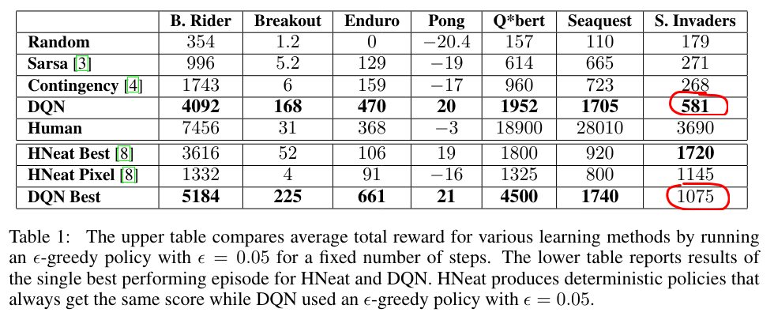

# Reinforcement Learning DQN Algorithm implementation

This is DQN Algorithm ([arXiv:1312.5602](https://arxiv.org/abs/1312.5602))
implementation from scratch for educational purposes. Use on your own risk.


## Evaluation

Paper reported perfomance:



### Evaluation on Space Invaders (unclipped reward)

| Model                                          | Max reward | Avg reward | Min reward |         Comment |
| :---                                           |       ---: |       ---: |       ---: |            ---: |
| space_invaders__default__1750532660__model.pth | 1000       | 611.5      | 490        | Best Max reward |
| space_invaders__default__1750622232__model.pth | 920        | 776.5      | 600        | Best Avg reward |

### Evaluation on Space Invaders (clipped reward)

| Model                                          | Max reward | Avg reward | Min reward |         Comment |
| :---                                           |       ---: |       ---: |       ---: |            ---: |
| space_invaders__default__1750639307__model.pth | 49         | 32.2       | 22         | Best Max reward |
| space_invaders__default__1750545955__model.pth | 36         | 34.6       | 34         | Best Avg reward |

## Setup

```sh
git clone https://github.com/revETE/dqn.git dqn_setup

python -m pip install -r ./dqn_setup/requirements.txt
python -m pip install ./dqn_setup
```

## Usage

```python
envs = AtariVectorEnv(game="space_invaders", num_envs=1)
q_network = QNetwork(envs.single_action_space.n).to(device)
checkpoint = torch.load(model_path, weights_only=True)
q_network.load_state_dict(checkpoint["q_network_state_dict"])
q_network.eval()

observations, info = envs.reset()
for range(1000):
    with torch.no_grad():
        x = torch.Tensor(observations).to(device)
        q_values = q_network(x) # shape=(n_envs, n_actions)
        actions = torch.argmax(q_values, dim=1).cpu().numpy() # shape=(n_envs,)

    (
        observations_next,  # shape=(n_envs, n_frames, d_rows, d_cols)
        rewards,  # shape=(n_envs,)
        terminated,  # shape=(n_envs,)
        _,
        info,
    ) = envs.step(actions)
    observations = observations_next
```

## Training models

### CLI
```sh
dqn-train -c assets/space_invaders.yaml
```

### Notebook

```python
config_yaml = """
device: cuda
env_id: space_invaders
n_envs: 16

n_timesteps: 650000
n_eval_timesteps: 3000
evaluate_model_frequency: 5000

optimizer_lr: 0.001

checkpoint_frequency: 5000
checkpoint_path: ./run
tensorboard_path: ./run/tb

replay_buffer_warmup: 20000
replay_buffer_capacity: 300000
"""

config_dict = yaml.safe_load(config_yaml)
cfg = dacite.from_dict(data_class=Config, data=dict(config_dict))

# Create a vector environment
envs = AtariVectorEnv(game=cfg.env_id, num_envs=cfg.n_envs, thread_affinity_offset=1)
eval_envs = AtariVectorEnv(game=cfg.env_id, num_envs=1)

state = State(cfg)
rb = ReplayBuffer(cfg.replay_buffer_capacity)
q_network = QNetwork(envs.single_action_space.n).to(cfg.device)
optimizer = torch.optim.AdamW(q_network.parameters(), lr=cfg.optimizer_lr)

# Load checkpoint if any
state.checkpoint_load(cfg, q_network, optimizer, rb)

# Hard training ))
try:
    train(envs, eval_envs, cfg, state, rb, q_network, optimizer)
except KeyboardInterrupt:
    print("Interrupted")
finally:
    state.checkpoint_save(cfg, q_network, optimizer, rb, force=True)
    state.close()
```
